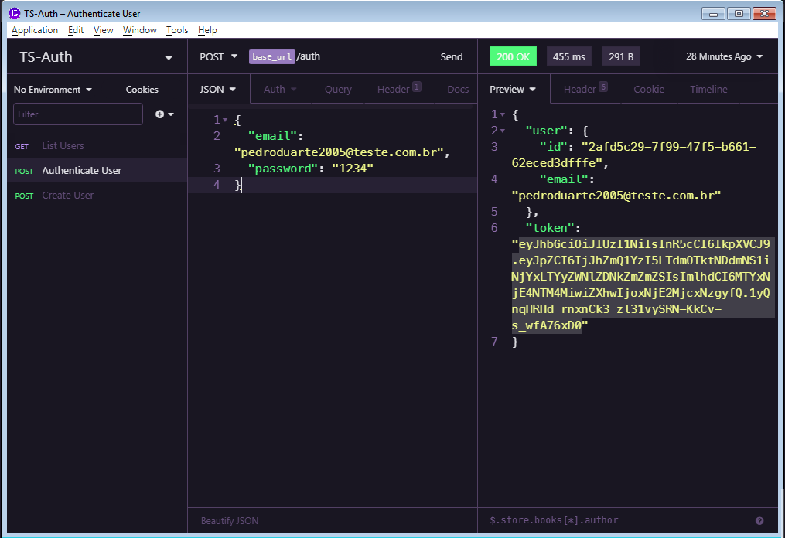

# TS-Auth

  <a href="#-projeto">Projeto</a>&nbsp;&nbsp;&nbsp;|&nbsp;&nbsp;&nbsp;
  <a href="#-tecnologias">Tecnologias</a>&nbsp;&nbsp;&nbsp;|&nbsp;&nbsp;&nbsp;
  <a href="#-começando">Tecnologias</a>&nbsp;&nbsp;&nbsp;|&nbsp;&nbsp;&nbsp;
  <a href="#memo-licença">Licença</a>

## 💻 Projeto
TS Auth é uma API de Autenticação JWT de Usuários

## 🚀 Tecnologias
- [Node.js](https://nodejs.org)
- [TypeScript](https://www.typescriptlang.org/)
- [JWT](https://jwt.io)
- [TypeORM](https://typeorm.io)

## Começando

- Clone esse repositório `git clone https://github.com/pduartesilva2005/ts-auth-2.0.git `
- Entre na pasta `cd ts-auth-2.0`
- Instale as Depedências `yarn` ou `npm install`
- Rode as Migrations `yarn typeorm migration:run`
- Rode o Projeto `yarn dev`

## :memo: Licença

Esse projeto está sob a licença MIT. Veja o arquivo [LICENSE](LICENSE.md) para mais detalhes.

Feito com ♥ by Pedro Duarte :wave:
